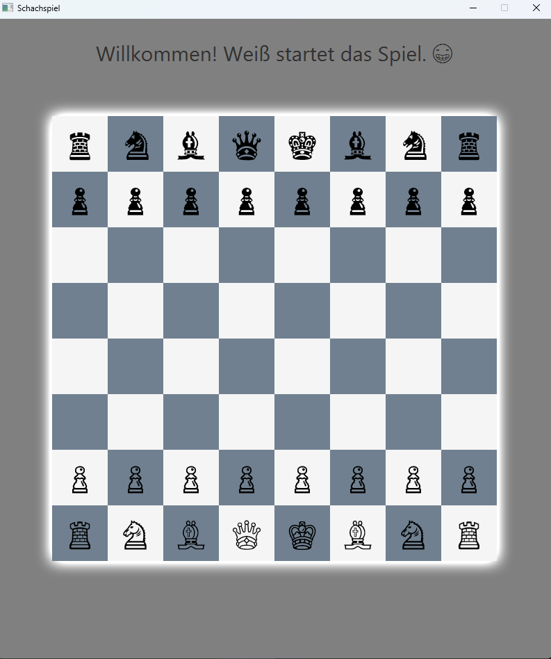
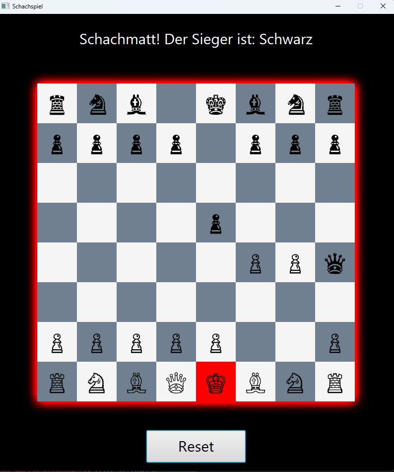
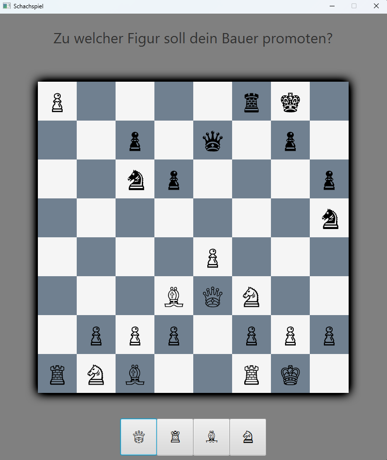

# Schachspiel:

- Lokales 2-Spieler-Schachspiel mit grafischer Oberfläche, vollständiger Zugvalidierung und Schach-/Schachmatt-Erkennung.
- Später erweiterbar, um das Laden von Partien aus dem PGN-Format, einem eigenen Schach-Bot und/oder einem Remote Multiplayer.

# Features:

- Komplettes Schach-Regelwerk: Unterstützt alle Standard Schachzüge, inklusive kurzer und langer Rochade, Bauern Promotion und En-Passant
- Spielzustand-Erkennung: Überprüfung von Schach, Schachmatt und Patt nach jedem Zug um sicher Siegeserkennung zu gewährleisten
- Spieler-Feedback: Intuitive Anzeige, welcher Spieler am Zug ist, ob man im Schach steht und wer der Sieger ist

# Roadmap:

- [X] Projekt aufsetzen (Gradle + JavaFX, GitHub Repo)
- [X] Brett-GUI: 8x8-Raster mit Figuren in Startposition
- [X] Klick-Logik: Figur + Zielfeld auswählen, Figur bewegt sich (noch ohne Regeln)
- [X] Grundlegende Zugregeln pro Figurentyp
- [X] Schlagen von Figuren
- [X] Spielerwechsel + Anzeige
- [X] Schach-Erkennung
- [X] Schachmatt- und Patt- Erkennung + Spielende
- [X] Rochade implementieren
- [X] Bauern-Promotion implementieren
- [X] En-Passant implementieren
- [ ] Optional, später: Laden von Spielen aus dem PGN-Format, eigener Schach-Bot, Remote Multiplayer

# Tech Stack:

- Sprache: Java
- UI-Framework: JavaFX
- Build-Tool: Gradle
- Versionsverwaltung: Git, Github

# Installation & Start:
1. Lade die aktuelle Schachspiel_v1.0.zip aus dem Bereich Releases herunter.
2. Entpacke die ZIP-Datei an einem Ort deiner Wahl auf deinem Computer.
3. Öffne den entpackten Ordner und gehe in den Unterordner bin.
4. Starte das Spiel per Doppelklick auf die Datei Schachspiel.bat.

- Hinweis für Windows-Nutzer:
Da dieses Programm ein privates Projekt ist, kann beim ersten Start eine Sicherheitsmeldung von Windows ("Der Computer wurde durch Windows geschützt") erscheinen.

1. Klicke auf "Weitere Informationen".
2. Klicke auf den Button "Trotzdem ausführen".
3. Das Spiel startet danach mit einem Konsolenfenster – bitte lass dieses Fenster während des Spielens einfach im Hintergrund offen, da sich sonst das Spiel mit schließt

# Demo:

