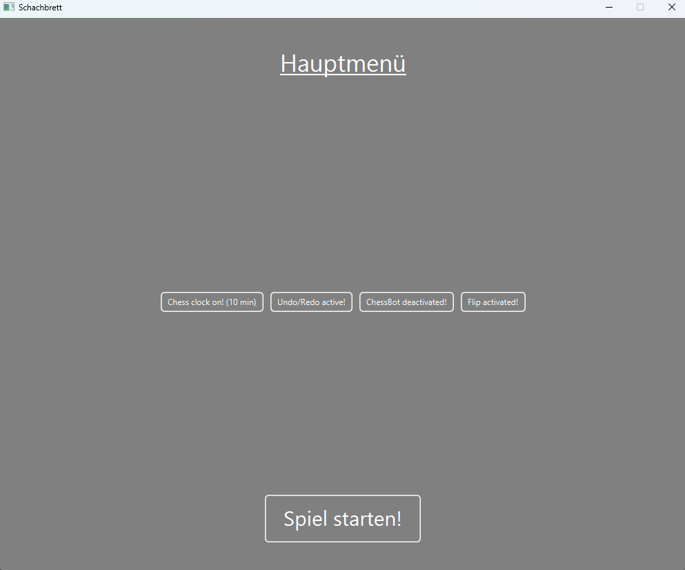

# Chess Game

- A local 2-player chess application featuring a Graphical User Interface (GUI), complete move validation, and check/checkmate detection.
- Designed with future extensibility in mind (e.g., PGN file loading or remote multiplayer).

## Features

- **Full Chess Ruleset:** Supports all standard chess moves, including castling (kingside/queenside), pawn promotion, and *en passant*.
- **Game State Detection:** Real-time evaluation of check, checkmate, and stalemate after every move to ensure accurate game-ending conditions.
- **Move History & Undo/Redo:** Real-time logging of all played moves with instant Undo and Redo navigation buttons.
- **Captured Pieces Tracker:** Dynamic side-panel display using FlowPane layouts with custom piece styling and Unicode symbols for both White and Black.
- **Visual Move Indicators:** Clear UI highlights showing all legal target squares when selecting a piece.
- **Integrated Chess Clock:** Dual countdown timers for timed competitive play.
- **Board flip animation:** The board (if enabled) smoothly rotates after each move so both players always view from their own perspective.
- **Main Menu with Settings:** A dedicated main menu allows toggling the ches clock, undo/redo buttons, board flip animation, and the chess bot before starting a game.
- **Polished UI & Controls:** Modern dark aesthetic featuring board glow effect, intuitive turn indication, and quick-action buttons to reset or go back to the main menu.
- **Chess bot (Computer Component):** A built-in AI opponent powered by the Minimax algorithm with Alpha-Beta Pruning and Piece-Square Tables for positional evaluation. The bot can be enabled or disabled in from the main menu.

## Tech Stack & Architecture

- **Language:** Java
- **UI Framework:** JavaFX
- **Build Tool:** Gradle
- **Version Control:** Git, GitHub

## Chess Bot - How it works

The built-in chess bot uses the Minimax algorithm with Alpha-Beta Pruning to search for the best move.

- **Minimax**: Simulates all possible moves up to a set depth (currently 5 half-moves), assuming the opponent also plays optimally.
- **Alpha-Beta Pruning**: Cuts off branches of the search tree that cannot possibly affect the final result, significantly reducing computation time.
- **Piece-Square Tables**: Each piece type has a positional value table that rewards good squares. The king uses a separate endgame table once material drops below a certein value.
- **Endgame detection**: The bot automatically switches to endgame king positioning once sufficient material has been traded off.
- **Randomized Equal Moves**: When multiple moves are evaluated as equal, one is chosen at random to avoid repetitive opening play.

## Roadmap

- [x] Project setup (Gradle + JavaFX, GitHub Repo)
- [x] Board GUI: 8x8 grid rendering with starting piece layouts
- [x] Click Interaction: Piece selection and field targeting
- [x] Basic move validation rules per piece type
- [x] Piece capturing logic
- [x] Turn switching and UI status updates
- [x] Check detection
- [x] Checkmate & Stalemate detection (Game Over logic)
- [x] Castling implementation (Kingside / Queenside)
- [x] Pawn promotion implementation
- [x] *En passant* implementation
- [X] Small move History with Undo- and Redo- Buttons
- [X] Move History implemented in the UI
- [X] Buttons for reseting the round and closing the application
- [X] Indicators showing all possible moves
- [X] Chess clock implementation
- [X] Captured pieces lists
- [X] Basic Main Menu with game settings
- [X] Board rotate animation after each move
- [X] Main Menu with configurable game settings
- [X] Chess Bot: Minimax algorithm with Alpha-Beta Pruning and Piece-Square Tables
- [ ] *Optional / Planned:* PGN file parser, remote multiplayer support

## Installation & Quick Start

1. Download the latest `Schachspiel_v1.3.0.zip` from the **Releases** section on GitHub.
2. Extract the ZIP archive to a folder of your choice on your computer.
3. Open the extracted folder and navigate to the `bin` subfolder.
4. Launch the game by double-clicking the `Schachspiel.bat` file.

> **Note for Windows Users:**
> Since this application is a private, unsigned project, Windows SmartScreen may display a security warning (*"Windows protected your PC"*).
>
> 1. Click on **"More info"**.
> 2. Click the **"Run anyway"** button.
> 3. *Note:* A console window will open alongside the game interface. Please keep this console window open in the background while playing, as closing it will terminate the game.

## Demo

